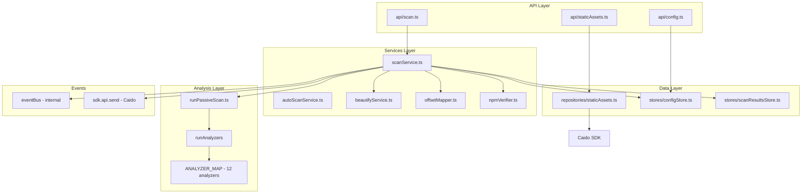
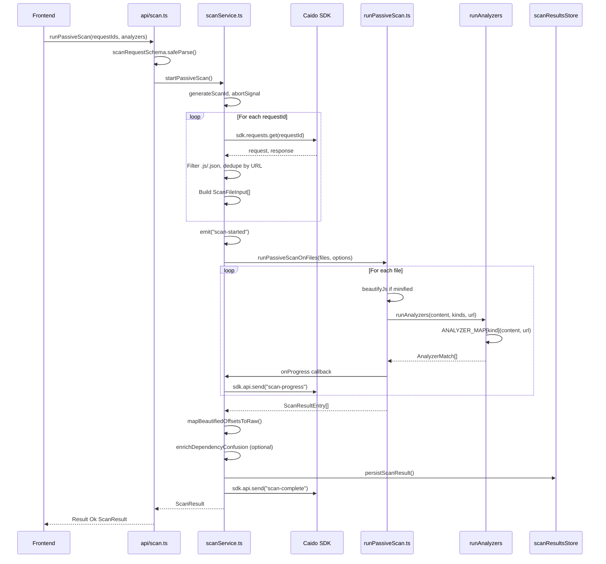
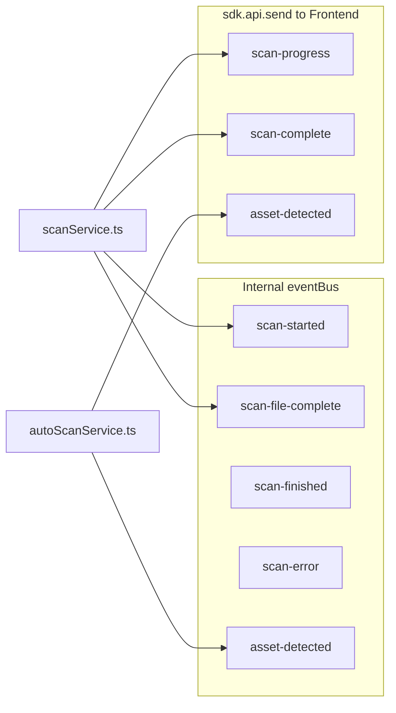

# JS Analyzer Backend Architecture

The backend is a Caido plugin layer that provides JavaScript and static file analysis. It follows a layered architecture: API handlers validate input and delegate to services; services orchestrate business logic and call repositories/stores; analyzers are pure functions that produce matches from content.

## Layer Diagram



## Scan Request Flow



## Event Flow



Internal events (`scan-started`, `scan-file-complete`, etc.) are used for backend coordination. Caido events (`scan-progress`, `scan-complete`, `asset-detected`) are sent to the frontend via `sdk.api.send()` for UI updates.

## Directory Structure

```
packages/backend/src/
├── index.ts              # Plugin entry, API registration, init
├── sdk.ts                # SDK singleton (getSDK, setSDK)
├── constants.ts          # Static asset detection, query page size
│
├── api/                  # API layer - Caido handlers
│   ├── scan.ts           # runPassiveScan, runPassiveScanOnContent, getScanResults, cancelScan
│   ├── config.ts         # getConfig, updateConfig
│   └── staticAssets.ts   # getStaticAssets
│
├── services/             # Business logic
│   ├── scanService.ts    # startPassiveScan, cancelScan, enrichDependencyConfusion
│   ├── autoScanService.ts # Intercept response handler, asset-detected events
│   ├── beautifyService.ts # JS beautification for minified content
│   ├── offsetMapper.ts   # Map beautified offsets back to raw content
│   └── npmVerifier.ts    # NPM package verification (dependencyConfusion)
│
├── repositories/         # Data access
│   └── staticAssets.ts   # getStaticAssetsFromHistory (Caido request history)
│
├── stores/               # State persistence (JSON on disk)
│   ├── index.ts
│   ├── projectStore.ts   # GlobalStore, ProjectScopedStore base
│   ├── configStore.ts   # User config (config.json, global)
│   └── scanResultsStore.ts # Scan results (scan-results.json, project-scoped)
│
├── events/               # Internal event bus
│   ├── index.ts
│   ├── eventBus.ts       # on, off, emit, reset
│   └── types.ts          # InternalEventMap
│
├── validation/           # Input validation
│   └── schemas.ts        # Zod schemas (scanRequest, scanContent, config, filter)
│
├── analyzers/            # Analysis modules
│   ├── index.ts          # runAnalyzers, ANALYZER_MAP
│   ├── types.ts          # AnalyzerFn, AnalyzerRegistry
│   ├── runPassiveScan.ts # scanSingleFile, runPassiveScanOnFiles
│   ├── apiEndpoints.ts
│   ├── callPatterns.ts
│   ├── chunkDiscovery.ts
│   ├── cloudUrls.ts
│   ├── dependencyConfusion.ts
│   ├── frameworkPatterns.ts
│   ├── inlineSourceMap.ts
│   ├── secrets.ts
│   ├── securitySinks.ts
│   ├── sensitiveData.ts
│   ├── stringExpressions.ts
│   ├── subdomains.ts
│   └── patterns/
│       ├── cloudPatterns.ts
│       ├── chunkPatterns.ts
│       ├── frameworkPatterns.ts
│       ├── secretPatterns.ts
│       ├── securitySinkPatterns.ts
│       └── sensitiveDataPatterns.ts
│
└── errors/               # Custom error types
    └── index.ts          # StoreError, ScanError
```

## Key Components

| Layer | Purpose |
|-------|---------|
| **api/** | Caido API handlers. Validate input with Zod, call services, return `Result<T>`. No business logic. |
| **services/** | Orchestration. `scanService` drives the scan lifecycle: fetch requests, build files, run analyzers, map offsets, persist. `autoScanService` reacts to intercepted responses. |
| **repositories/** | Access Caido request history via `sdk.requests.query()`. `getStaticAssetsFromHistory` filters by scope/HTTPQL and content type. |
| **stores/** | Persist config and scan results to JSON files. Config is global; scan results are project-scoped. |
| **analyzers/** | Pure functions `(content, url?) => AnalyzerMatch[]`. 12 analyzers registered in `ANALYZER_MAP`. Pattern-based; no side effects. |
| **events/** | Internal pub/sub for backend coordination. Caido events sent via `sdk.api.send()` to frontend. |
| **validation/** | Zod schemas for API inputs. Single source of truth for request shapes. |
| **errors/** | Custom error classes for store failures, scan failures, filter/asset errors. |

## Persistence

| Store | Type | File | Scope |
|-------|------|------|-------|
| Config | GlobalStore | `config.json` | Plugin-wide |
| Scan results | ProjectScopedStore | `projects/{projectId}/scan-results.json` | Per project |

## Dependencies

- **Caido**: `caido:plugin`, `caido:utils` (Request, Response, Cursor)
- **Shared**: `shared` (AnalyzerKind, ScanResult, UserConfig, etc.)
- **Validation**: `zod`
